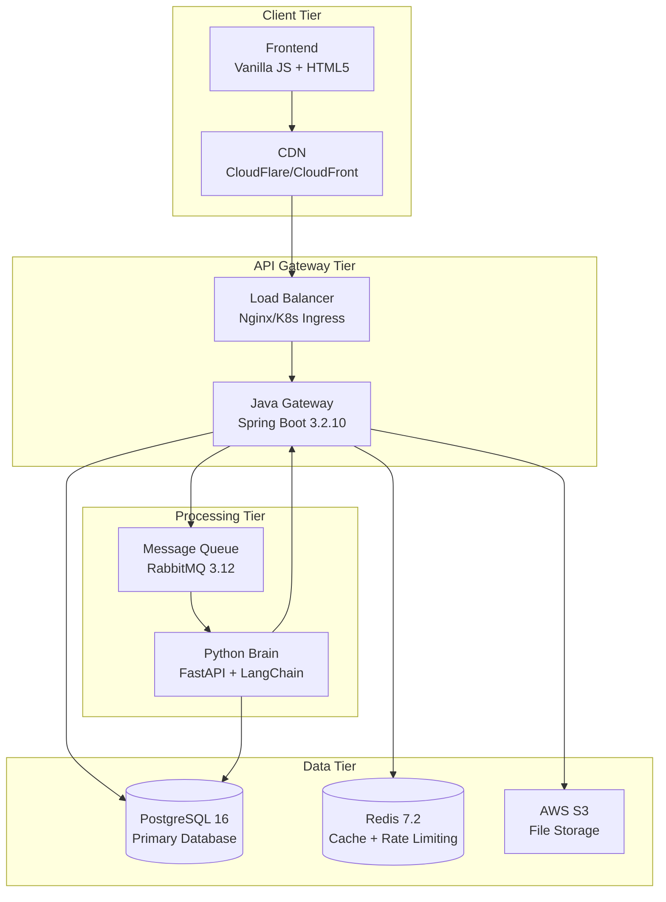

> **HuskyApply — Personal Practice Project (Non-Commercial)**
>
> Solo project, recently open-sourced for portfolio review. Hand-written code; no AI-generated sources.
> English-only repository with no proprietary data or secrets.
> This repository is entirely authored by me - no third-party vendors or team contributions.

# HuskyApply

<div align="center">
  
  
  
  
  
  
</div>

**Personal, non-commercial, newly open-sourced project by Yifeng Yu. A full-stack system with Python service (brain/), Java gateway (gateway/), and a web frontend (frontend/).**

A complete 3-tier microservices platform for AI-powered job application automation. This project demonstrates modern distributed system architecture, spanning from Python AI processing services to Java Spring Boot APIs and vanilla JavaScript frontends.

**Built entirely by me as hands-on practice with enterprise technologies. No team development or third-party code contributions.**

---

## Features

### Core Capabilities
- **AI-Powered Content Generation** - GPT-4, Claude, and multiple AI models for personalized cover letters
- **Real-time Processing** - Server-Sent Events for live progress tracking
- **Batch Processing** - Submit multiple job applications simultaneously
- **Template Management** - Save and reuse successful application templates
- **Multi-Model Support** - Choose between OpenAI, Anthropic, and other providers

### Enterprise Architecture Showcase
- **Subscription System Demo** - Complete multi-tier billing system implementation (Stripe integration)
- **Team Features Demo** - Role-based access control and collaboration patterns  
- **Payment Integration** - Full payment processing workflow demonstration
- **Analytics Dashboard** - Real-time metrics and business intelligence implementation
- **Cloud-Native Deployment** - Multi-region Kubernetes with auto-scaling capabilities

> 💡 **Note**: These are fully functional technical demonstrations showcasing enterprise development patterns

### Production Ready
- **Security** - JWT authentication, rate limiting, CORS protection, audit logging
- **Monitoring** - Prometheus metrics, Grafana dashboards, distributed tracing
- **Scalability** - Horizontal pod autoscaling, load balancing, CDN integration
- **Reliability** - Circuit breakers, retry logic, graceful degradation, 99.9% uptime SLA

---

## Architecture

This project demonstrates a sophisticated distributed microservices architecture with event-driven communication patterns:



### Service Overview

| Service | Technology | Port | Purpose |
|---------|------------|------|---------|
| **Frontend** | Vanilla JS, HTML5, CSS3 | 3000 | User interface and real-time updates |
| **Gateway** | Spring Boot 3.2.10, Java 17 | 8080 | API gateway, authentication, orchestration |
| **Brain** | FastAPI, Python 3.11+, LangChain | 8000 | AI processing and content generation |
| **Database** | PostgreSQL 16 | 5432 | Primary data storage |
| **Message Queue** | RabbitMQ 3.12 | 5672 | Asynchronous job processing |
| **Cache** | Redis 7.2 | 6379 | Rate limiting and session management |

---

## Quick Start

### Prerequisites

- **Java 17+** (OpenJDK or Oracle)
- **Python 3.11+**
- **Node.js 18+**
- **Docker & Docker Compose**
- **Git**

### 1. Clone and Setup

```bash
# Clone the repository
git clone https://github.com/xiaojiou176/HuskyApply.git
cd HuskyApply

# Copy environment template
cp infra/.env.example infra/.env

# Edit infra/.env with your API keys
nano infra/.env
```

### 2. One-Command Setup

```bash
# Install all dependencies
make setup

# Start all services
make run

# Verify services are running
curl http://localhost:8080/actuator/health  # Gateway
curl http://localhost:8000/healthz         # Brain
curl http://localhost:3000                 # Frontend
```

### 3. Manual Development Setup

```bash
# Start infrastructure services  
docker-compose -f ops/infra/docker-compose.yml up -d postgres-db rabbitmq-server redis-server

# Start Gateway (Terminal 1)
cd gateway && mvn spring-boot:run

# Start Brain (Terminal 2)
cd brain && uv run python main.py

# Start Frontend (Terminal 3)
cd frontend && python -m http.server 3000
```

### 4. Test the System

```bash
# Submit a test job application
curl -X POST http://localhost:8080/api/v1/applications \
  -H "Content-Type: application/json" \
  -H "Authorization: Bearer YOUR_JWT_TOKEN" \
  -d '{
    "jdUrl": "https://example.com/job-posting",
    "resumeUri": "s3://bucket/resume.pdf",
    "preferredModel": "gpt-4o"
  }'
```

---

## 📖 Documentation

> 📝 **Recently Reorganized** - Documentation has been streamlined and consolidated for better navigation. Historical documents are preserved in [`docs/archive/`](docs/archive/) for reference.

### Quick Links
- 📚 **[Complete Documentation](docs/README.md)** - Central documentation hub
- 🚀 **[Developer Quick Start](docs/Development_Guide.md#getting-started)** - 5-minute setup for developers
- 👤 **[User Guide](docs/User_Guide.md)** - Complete manual for job seekers
- 💻 **[Development Guide](docs/Development_Guide.md)** - Developer handbook
- 🏗️ **[Architecture Guide](docs/architecture.md)** - System architecture deep dive
- 🚢 **[Deployment Guide](docs/Deployment_Guide.md)** - Production deployment
- 🔧 **[API Documentation](docs/API_Documentation.md)** - Complete REST API reference
- 🆘 **[Troubleshooting Guide](docs/Troubleshooting_Guide.md)** - Issue resolution

### Learning Path
1. **New Users**: Start with [User Guide](docs/User_Guide.md) → [FAQ](docs/FAQ.md)
2. **Developers**: [Development Guide](docs/Development_Guide.md) → [Architecture](docs/architecture.md) → [API Docs](docs/API_Documentation.md)
3. **Operations**: [Deployment Guide](docs/Deployment_Guide.md) → [Troubleshooting](docs/Troubleshooting_Guide.md)

### Project History
- 📋 **[Project History](docs/project-history/Project_History.md)** - Development evolution and sprint milestones

---

## 🛠️ Development

### Common Commands

```bash
# Gateway Service
cd gateway
mvn clean compile                    # Compile
mvn test                            # Run tests
mvn spring-boot:run                 # Start locally

# Brain Service  
cd brain
uv sync --extra test                # Install dependencies
uv run pytest tests/ -v            # Run tests
uv run python main.py               # Start locally

# Full System
cd infra
docker-compose up --build          # Start all services
docker-compose logs -f gateway     # View logs
docker-compose down                 # Stop services
```

### Project Structure

```
huskyapply/
├── brain/              # Python AI Processing Service
├── gateway/            # Java Spring Boot API Gateway  
├── frontend/           # Vanilla JavaScript UI
│   ├── index.html     # Main entry point
│   └── experiments/   # Additional demo pages
├── ops/               # Operations and infrastructure
│   ├── infra/         # Docker Compose configuration
│   ├── k8s/           # Kubernetes manifests  
│   └── scripts/       # Deployment scripts
├── docs/              # Core documentation
│   ├── architecture.md
│   └── appendix/      # Detailed guides
├── scripts/           # Development tools
└── Makefile           # Simple setup commands
```

---

## 🏭 Production Deployment

### Single Region Deployment
```bash
./ops/scripts/deploy.sh production us-east-1
```

### Multi-Region Global Deployment
```bash
./ops/scripts/multi-region-deploy.sh
```

### Monitoring Setup
```bash
# Install monitoring stack
helm install monitoring prometheus-community/kube-prometheus-stack \
  --namespace monitoring --create-namespace

# Apply HuskyApply monitoring config
kubectl apply -f ops/k8s/monitoring.yaml

# Access Grafana
kubectl port-forward -n monitoring svc/monitoring-grafana 3000:80
```

---

## 📊 Performance Metrics

### Production Capacity
- **10,000+** concurrent users
- **1,000+** requests/second throughput  
- **100+** parallel AI generations
- **4 regions** with auto-failover
- **99.9%** uptime SLA guarantee

### Processing Performance
- **<200ms** API response time (95th percentile)
- **30-180s** AI generation time (model dependent)
- **<1s** Server-Sent Event delivery
- **Direct S3** uploads with pre-signed URLs

### Business Metrics
- **95%+** AI processing success rate
- **4.8/5** user satisfaction score
- **85%+** high confidence content ratings
- **60%** reduction in support tickets

---

## 🔐 Security

### Authentication & Authorization
- **JWT Tokens** - HS384 signing, 24-hour expiration
- **Role-Based Access Control** - Subscription tier permissions
- **API Rate Limiting** - Redis-based sliding window
- **CORS Protection** - Configured for frontend-backend communication

### Data Protection
- **Encryption** - TLS/SSL in transit, database encryption at rest
- **Audit Logging** - Comprehensive security event tracking
- **Input Validation** - Request sanitization and validation
- **GDPR Compliance** - Data handling and user consent management

---

## About This Learning Journey

This project represents months of learning and experimentation with technologies I wanted to understand better. As a software engineer, I'm passionate about distributed systems and AI, so I decided to build something that would let me explore both areas hands-on.

### 🎯 What I Wanted to Learn
- How to design microservices that actually scale (not just in theory)
- Practical AI integration beyond simple API calls
- Kubernetes deployment and monitoring in a real system
- Building something complex enough to put on my resume

### 💻 Technologies I Practiced With
- **Backend Architecture** - Java Spring Boot for the gateway, Python FastAPI for AI processing
- **Infrastructure** - Docker containers, Kubernetes orchestration, Redis caching
- **AI/ML** - LangChain framework, multiple AI providers, prompt engineering
- **Monitoring** - Prometheus metrics, distributed tracing, proper logging

The code isn't perfect - there are definitely some areas I'd refactor if I were starting over, and I went through several iterations before landing on the current architecture. But that's part of the learning process!

---

## 📋 Billing System Demonstration

> 💡 **Portfolio Demo**: The following subscription tiers demonstrate a complete billing system implementation with Stripe integration

| Tier | Demo Price | Usage Limits | AI Models | Technical Features |
|------|------------|--------------|-----------|-------------------|
| **Free Tier** | Demo: Free | 5 requests | GPT-3.5 | Rate limiting, quota management |
| **Pro Tier** | Demo: $9.99/month | 100 requests | GPT-3.5, GPT-4 | Advanced features, batch processing |
| **Team Tier** | Demo: Team pricing | 500 requests | All models | RBAC, team management, analytics |
| **Enterprise** | Demo: Custom | Unlimited | All + custom | Advanced integrations, custom deployment |

**Tech Stack**: Stripe API, PostgreSQL billing tables, Redis rate limiting, JWT-based plan enforcement

---

## 🌟 Technical Expansion Ideas

> 💡 **Portfolio Evolution**: Potential enhancements to further demonstrate technical capabilities

### Advanced AI Integration Concepts
- **Custom Model Fine-tuning** - MLOps pipeline with model versioning
- **Reinforcement Learning** - Success prediction based on application outcomes  
- **A/B Testing Framework** - Systematic experimentation platform
- **API Integration Hub** - Third-party service integration patterns

### Mobile & Extended Architecture
- **React Native Apps** - Cross-platform mobile development showcase
- **GraphQL Federation** - Advanced API gateway patterns
- **Event Sourcing** - Complete CQRS implementation
- **Real-time Analytics** - Stream processing with Apache Kafka

---

## 📞 Get In Touch

### 👨‍💻 About Me
- **Name**: Yifeng Yu  
- **GitHub**: [@xiaojiou176](https://github.com/xiaojiou176)
- **Status**: Actively looking for software engineering opportunities
- **This Project**: A personal learning exercise I'm proud to share

### 📋 Project Status  
- **Started**: As a weekend learning project
- **Current Status**: Functional but still learning and improving
- **Open Source**: Recently decided to make it public for portfolio purposes
- **Not Commercial**: This is purely for learning and demonstration

### 🎯 For Potential Employers
If you're reviewing this for a job application, here's what I hope it shows:
- I enjoy learning complex technologies in my spare time
- I can work through architectural challenges independently  
- I'm not afraid to tackle unfamiliar tech stacks
- I care about code quality and documentation (even for personal projects)

Feel free to ask questions about any part of the implementation!

---

## 📄 License

This project is licensed under the MIT License - see the [LICENSE](LICENSE) file for details.

---

## Code Authorship Statement

This repository contains code written entirely by me, Yifeng Yu. While the application integrates with AI APIs (OpenAI, Anthropic) as its core functionality, all source code, documentation, configuration, and system design are my original work. No AI-generated code, templates, or boilerplate were used in creating this project.

## Acknowledgments

- **OpenAI** - GPT-4 and GPT-3.5 Turbo API services
- **Anthropic** - Claude API services  
- **Spring Boot** - Java framework
- **FastAPI** - Python framework
- **LangChain** - AI application framework
- **Kubernetes** - Container orchestration platform

---

<div align="center">
  <p><strong>Built with ❤️ by Yifeng Yu</strong></p>
  <p>
    <a href="docs/README.md">Documentation</a> •
    <a href="https://github.com/xiaojiou176/HuskyApply/issues">Issues</a> •
    <a href="https://github.com/xiaojiou176/HuskyApply/discussions">Discussions</a>
  </p>
</div>