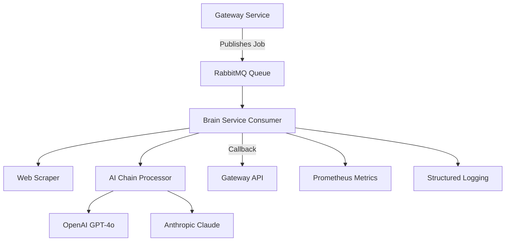

# 🧠 HuskyApply Brain Service

The Brain Service is the AI-powered core of HuskyApply, responsible for processing job descriptions and generating personalized cover letters using advanced language models.

## 🚀 Features

- **Multi-Provider AI Support**: OpenAI GPT-4o and Anthropic Claude integration
- **Asynchronous Processing**: RabbitMQ-based message queue system
- **Web Scraping**: Intelligent job description extraction from various job boards
- **Robust Error Handling**: Comprehensive exception handling with retry logic
- **Production Ready**: Full monitoring, metrics, and health checks
- **Type Safe**: Complete type hints for better development experience
- **Scalable Architecture**: Horizontal scaling with load balancing support

## 🏗️ Architecture



## 📋 Prerequisites

- Python 3.11+
- RabbitMQ server
- OpenAI API key (required)
- Anthropic API key (optional)
- Access to Gateway service

## 🛠️ Installation

### Using uv (Recommended)

```bash
# Install uv if you haven't already
pip install uv

# Install dependencies
uv sync

# Activate virtual environment
source .venv/bin/activate
```

### Using pip

```bash
# Create virtual environment
python -m venv .venv
source .venv/bin/activate

# Install dependencies
pip install -e .
```

### Using Docker

```bash
# Build production image
docker build -t huskyapply-brain .

# Build development image
docker build --target development -t huskyapply-brain:dev .

# Run with docker-compose
docker-compose up brain
```

## ⚙️ Configuration

### Environment Variables

Create a `.env` file in the project root:

```bash
# Copy example configuration
cp .env.example .env

# Edit configuration
nano .env
```

#### Required Variables

- `OPENAI_API_KEY`: Your OpenAI API key
- `INTERNAL_API_KEY`: Internal API key for Gateway communication
- `RABBITMQ_HOST`: RabbitMQ server hostname
- `RABBITMQ_USER`: RabbitMQ username
- `RABBITMQ_PASSWORD`: RabbitMQ password

#### Optional Variables

- `ANTHROPIC_API_KEY`: Anthropic API key for Claude models
- `GATEWAY_INTERNAL_URL`: Gateway service URL (default: http://localhost:8080)
- `LOG_LEVEL`: Logging level (default: INFO)
- `MAX_WORKERS`: Number of worker processes (default: 4)

### Production Configuration

For production deployments, use the comprehensive configuration in `config/production.py`:

```python
from config.production import ProductionConfig

# Validate configuration
issues = ProductionConfig.validate_config()
if issues:
    print("Configuration issues found:")
    for issue in issues:
        print(f"  - {issue}")
```

## 🚦 Running the Service

### Development Mode

```bash
# Run with hot reload
python main.py

# Or using uvicorn directly
uvicorn main:app --host 0.0.0.0 --port 8000 --reload
```

### Production Mode

```bash
# Using production configuration
gunicorn -c config/production.py main:app

# Using Docker
docker run -p 8000:8000 --env-file .env huskyapply-brain

# Using systemd (recommended)
sudo systemctl start huskyapply-brain
```

## 🔍 API Endpoints

### Health Check

```bash
curl http://localhost:8000/healthz
```

Response:
```json
{
  "status": "ok",
  "timestamp": 1703123456.789,
  "version": "0.0.1",
  "components": {
    "rabbitmq": {"status": "ok", "host": "localhost"},
    "openai": {"status": "ok", "configured": true},
    "anthropic": {"status": "ok", "configured": true},
    "gateway": {"status": "ok", "url": "http://localhost:8080"}
  },
  "metrics": {
    "uptime_seconds": 3600,
    "jobs_processed": 42
  }
}
```

### Metrics (Prometheus)

```bash
curl http://localhost:8000/metrics
```

## 🧪 Testing

### Running Tests

```bash
# Install test dependencies
uv sync --extra test

# Run all tests
pytest

# Run with coverage
pytest --cov=. --cov-report=html

# Run specific test categories
pytest -m unit        # Unit tests only
pytest -m integration # Integration tests only
pytest -m "not slow"  # Skip slow tests
```

### Test Categories

- **Unit Tests**: Fast, isolated tests for individual components
- **Integration Tests**: End-to-end tests with external dependencies
- **Performance Tests**: Load and stress testing scenarios

### Code Quality

```bash
# Install development dependencies
uv sync --extra dev

# Format code
black .
isort .

# Type checking
mypy .

# Linting
flake8 .

# Run all quality checks
make lint  # If Makefile is present
```

## 📊 Monitoring

### Prometheus Metrics

The service exposes the following metrics:

- `jobs_processed_total{status}`: Total number of jobs processed
- `job_processing_seconds`: Histogram of job processing duration
- `web_scraping_total{status}`: Web scraping attempt counts
- `web_scraping_seconds`: Web scraping duration histogram
- `ai_chain_seconds`: AI processing duration histogram

### Health Checks

The service provides comprehensive health checks for:

- RabbitMQ connectivity
- AI provider API availability
- Gateway service connectivity
- System resource usage

### Logging

Structured logging with configurable formats:

```json
{
  "timestamp": "2024-01-01T12:00:00Z",
  "level": "INFO",
  "service": "brain",
  "message": "Job processing completed",
  "trace_id": "abc123",
  "job_id": "job-456",
  "user_id": "user-789"
}
```

## 🔧 Development

### Project Structure

```
brain/
├── __init__.py              # Package initialization
├── main.py                  # FastAPI application and RabbitMQ consumer
├── ai_chain.py              # LangChain AI processing logic
├── retry_utils.py           # Retry and circuit breaker utilities
├── tracing_utils.py         # Distributed tracing utilities
├── exceptions.py            # Custom exception classes
├── config/
│   └── production.py        # Production configuration
├── tests/
│   ├── __init__.py
│   ├── test_main.py         # Main service tests
│   ├── test_ai_chain.py     # AI chain tests
│   └── test_integration.py  # Integration tests
├── pyproject.toml           # Project configuration
├── Dockerfile               # Multi-stage Docker build
├── .env.example             # Environment template
└── README.md                # This file
```

### Adding New AI Providers

1. Install the provider's Python client library
2. Update `create_llm()` in `ai_chain.py`
3. Add provider-specific configuration
4. Update tests and documentation
5. Add health check validation

### Error Handling

The service uses custom exception classes for better error categorization:

```python
from exceptions import AIProviderException, WebScrapingException

try:
    result = process_job(job_data)
except AIProviderException as e:
    logger.error(f"AI provider error: {e.to_dict()}")
except WebScrapingException as e:
    logger.error(f"Scraping failed: {e.to_dict()}")
```

## 🚀 Deployment

### Docker Deployment

```bash
# Build and deploy
docker build -t huskyapply-brain .
docker run -d \
  --name brain-service \
  --env-file .env \
  -p 8000:8000 \
  huskyapply-brain
```

### Kubernetes Deployment

```yaml
apiVersion: apps/v1
kind: Deployment
metadata:
  name: huskyapply-brain
spec:
  replicas: 3
  selector:
    matchLabels:
      app: huskyapply-brain
  template:
    metadata:
      labels:
        app: huskyapply-brain
    spec:
      containers:
      - name: brain
        image: huskyapply-brain:latest
        ports:
        - containerPort: 8000
        env:
        - name: OPENAI_API_KEY
          valueFrom:
            secretKeyRef:
              name: brain-secrets
              key: openai-api-key
        livenessProbe:
          httpGet:
            path: /healthz
            port: 8000
          initialDelaySeconds: 30
          periodSeconds: 10
        readinessProbe:
          httpGet:
            path: /healthz
            port: 8000
          initialDelaySeconds: 5
          periodSeconds: 5
```

### Performance Tuning

For high-throughput deployments:

1. **Scale horizontally**: Deploy multiple instances
2. **Tune RabbitMQ**: Adjust prefetch count and connection pooling
3. **Optimize AI calls**: Use batching and caching where appropriate
4. **Monitor resources**: Set appropriate CPU and memory limits
5. **Configure logging**: Use structured logging with appropriate levels

## 🔒 Security

### Best Practices

- Store API keys in environment variables or secure vaults
- Run containers as non-root user
- Enable TLS for all external communications
- Implement rate limiting and request validation
- Use network policies in Kubernetes
- Regular security updates and dependency scanning

### Environment Security

```bash
# Use secrets management
kubectl create secret generic brain-secrets \
  --from-literal=openai-api-key=your-key \
  --from-literal=internal-api-key=your-internal-key

# Scan for vulnerabilities
docker run --rm -v /var/run/docker.sock:/var/run/docker.sock \
  aquasec/trivy image huskyapply-brain:latest
```

## 🐛 Troubleshooting

### Common Issues

1. **RabbitMQ Connection Failed**
   ```bash
   # Check RabbitMQ status
   sudo systemctl status rabbitmq-server
   
   # Verify credentials
   rabbitmqctl list_users
   ```

2. **AI Provider Errors**
   ```bash
   # Test API connectivity
   curl -H "Authorization: Bearer $OPENAI_API_KEY" \
        https://api.openai.com/v1/models
   ```

3. **High Memory Usage**
   ```bash
   # Monitor memory usage
   docker stats huskyapply-brain
   
   # Adjust worker processes
   export MAX_WORKERS=2
   ```

4. **Slow Processing**
   ```bash
   # Check metrics
   curl http://localhost:8000/metrics | grep processing_seconds
   
   # Enable debug logging
   export LOG_LEVEL=DEBUG
   ```

### Logs Analysis

```bash
# View structured logs
docker logs huskyapply-brain | jq '.'

# Filter by job ID
docker logs huskyapply-brain | grep "job-123"

# Monitor error rates
docker logs huskyapply-brain | grep "ERROR" | wc -l
```

## 🤝 Contributing

1. Fork the repository
2. Create a feature branch (`git checkout -b feature/amazing-feature`)
3. Make your changes
4. Add tests for new functionality
5. Run quality checks (`make lint test`)
6. Commit your changes (`git commit -m 'Add amazing feature'`)
7. Push to the branch (`git push origin feature/amazing-feature`)
8. Open a Pull Request

### Development Workflow

```bash
# Setup development environment
git clone https://github.com/huskyapply/brain-service.git
cd brain-service
uv sync --extra dev --extra test

# Make changes and test
pytest
black .
mypy .

# Submit PR
gh pr create --title "Your feature" --body "Description"
```

## 📝 License

This project is licensed under the MIT License - see the [LICENSE](LICENSE) file for details.

## 🆘 Support

- **Documentation**: [Project Docs](../docs/README.md)
- **Issues**: [GitHub Issues](https://github.com/xiaojiou176/HuskyApply/issues)
- **Discussions**: [GitHub Discussions](https://github.com/xiaojiou176/HuskyApply/discussions)

## 🎯 Roadmap

- [ ] Support for additional AI providers (Cohere, Hugging Face)
- [ ] Advanced prompt engineering and A/B testing
- [ ] Real-time processing with WebSocket support
- [ ] Advanced caching and result optimization
- [ ] Multi-language support for international job markets
- [ ] Integration with popular job boards APIs
- [ ] Machine learning model fine-tuning capabilities

---

**Happy coding! 🚀**