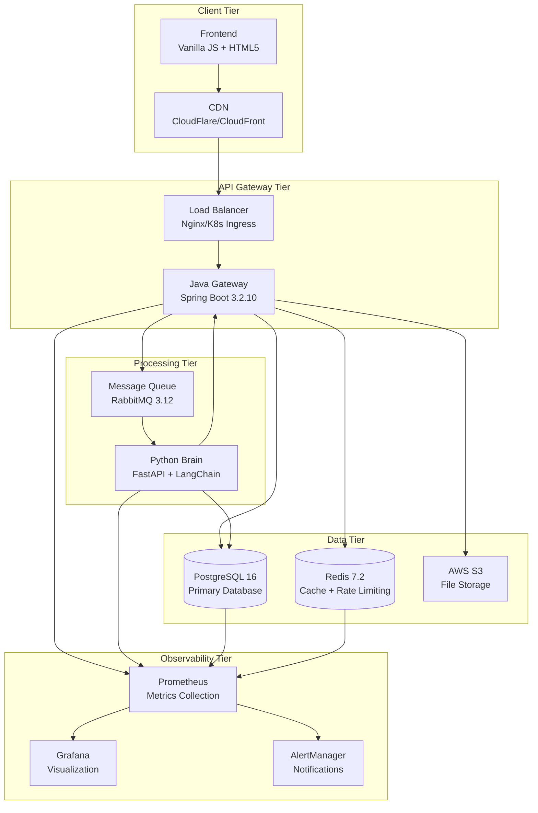
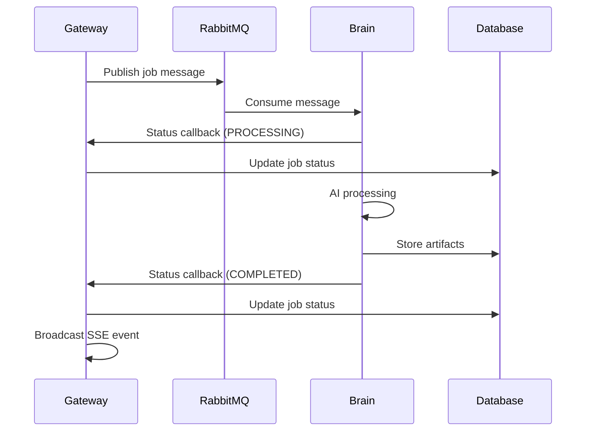
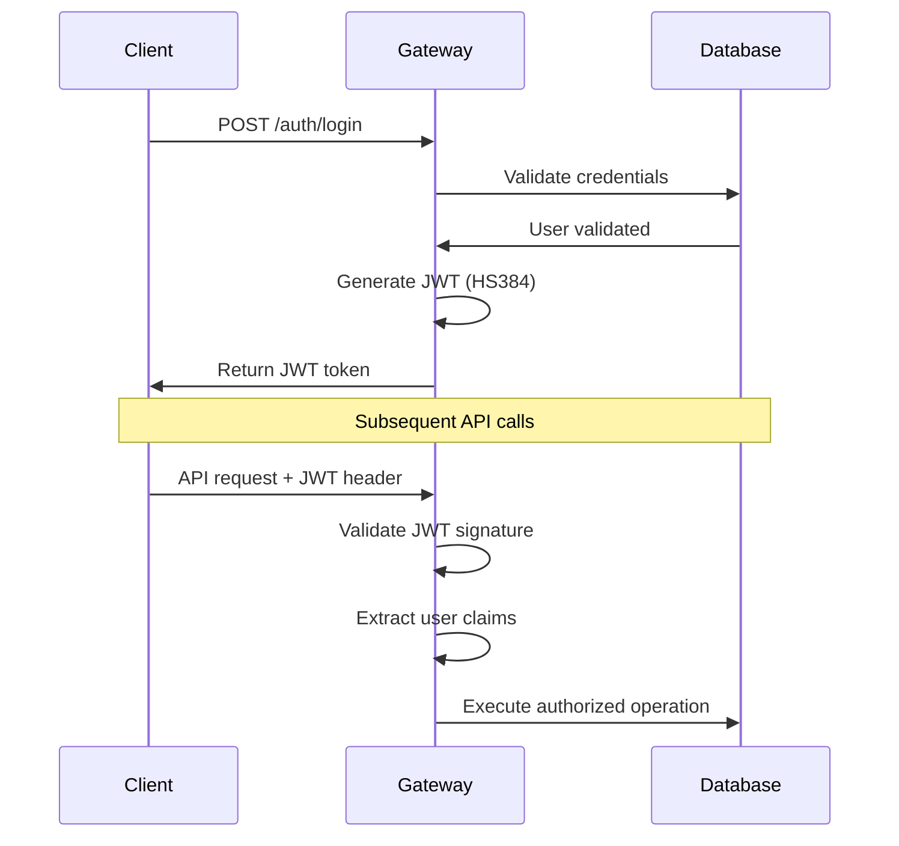

# HuskyApply System Architecture

## Overview

HuskyApply is a production-ready, enterprise-grade AI-powered job application platform built with a distributed microservices architecture. The system demonstrates modern cloud-native patterns including event-driven communication, horizontal scalability, and comprehensive observability.

## High-Level Architecture



## Service Architecture

### 1. Java Gateway Service (Port 8080)

**Technology Stack:**
- Java 17 + Spring Boot 3.2.10
- Spring Security + JWT Authentication
- Spring Data JPA + PostgreSQL
- RabbitMQ Integration
- Redis Integration
- AWS S3 Integration

**Core Responsibilities:**
- HTTP API endpoints and request validation
- User authentication and authorization
- Database persistence and transaction management
- Message publishing to RabbitMQ
- Server-Sent Events (SSE) streaming
- File storage coordination with S3
- Rate limiting and quota management
- Subscription and payment processing

**Package Structure:**
```
com.huskyapply.gateway/
├── controller/          # REST API endpoints
├── service/            # Business logic layer  
├── repository/         # Data access layer
├── model/             # JPA entities
├── dto/               # Data transfer objects
├── config/            # Configuration classes
├── security/          # Security components
├── exception/         # Exception handlers
└── util/              # Utility classes
```

**Key Components:**
- `AuthController` - User registration and authentication
- `JobController` - Job application management
- `DashboardController` - User dashboard and statistics
- `TemplateController` - Cover letter template management
- `BatchJobController` - Batch processing operations
- `SubscriptionController` - Subscription and billing
- `JwtAuthenticationFilter` - JWT token validation
- `RateLimitService` - Redis-based rate limiting
- `SseManager` - Server-Sent Events management

### 2. Python Brain Service (Port 8000)

**Technology Stack:**
- Python 3.11 + FastAPI
- LangChain + OpenAI GPT-4o + Anthropic Claude
- Async RabbitMQ consumer
- PostgreSQL async driver
- Structured logging with correlation IDs

**Core Responsibilities:**
- AI content generation using LangChain
- Multi-provider AI model support (OpenAI, Anthropic)
- RabbitMQ message consumption
- Job description parsing and analysis
- Cover letter generation with personalization
- HTTP callbacks to Gateway for status updates
- Error handling and retry logic

**File Structure:**
```
brain/
├── main.py             # FastAPI application and RabbitMQ consumer
├── ai_chain.py         # LangChain AI processing chains
├── retry_utils.py      # Retry logic and circuit breaker
├── tracing_utils.py    # Distributed tracing utilities
├── config.py          # Configuration management
└── tests/             # Unit and integration tests
```

**Key Components:**
- `AIContentGenerator` - Multi-provider AI chain orchestration
- `JobDescriptionParser` - JD analysis and skill extraction
- `CoverLetterGenerator` - Personalized content generation
- `RabbitMQConsumer` - Async message processing
- `CallbackService` - HTTP status updates to Gateway

### 3. Frontend Application

**Technology Stack:**
- Vanilla JavaScript (ES6+)
- HTML5 + CSS3 + Responsive Design
- Server-Sent Events (EventSource API)
- No framework dependencies

**Core Features:**
- User authentication and registration
- Job description submission
- Real-time progress tracking via SSE
- Generated content display and management
- User dashboard with statistics
- Template management interface
- Subscription and billing management

**File Structure:**
```
frontend/
├── index.html          # Main application page
├── app.js             # Core application logic
├── auth.js            # Authentication handling
├── dashboard.js       # Dashboard functionality
├── styles.css         # Application styling
└── assets/            # Static assets
```

## Data Architecture

### Database Design (PostgreSQL 16)

**Core Tables:**

```sql
-- User Management
users (
    id UUID PRIMARY KEY,
    email VARCHAR UNIQUE NOT NULL,
    password VARCHAR NOT NULL,
    subscription_plan_id UUID REFERENCES subscription_plans(id),
    stripe_customer_id VARCHAR,
    created_at TIMESTAMP,
    updated_at TIMESTAMP
);

-- Job Applications
jobs (
    id UUID PRIMARY KEY,
    user_id UUID REFERENCES users(id),
    jd_url VARCHAR,
    resume_uri VARCHAR,
    status VARCHAR NOT NULL,
    created_at TIMESTAMP,
    updated_at TIMESTAMP
);

-- Generated Content
artifacts (
    id UUID PRIMARY KEY,
    job_id UUID REFERENCES jobs(id),
    content_type VARCHAR NOT NULL,
    generated_text TEXT,
    word_count INTEGER,
    extracted_skills JSONB,
    created_at TIMESTAMP,
    updated_at TIMESTAMP
);

-- Subscription System
subscription_plans (
    id UUID PRIMARY KEY,
    name VARCHAR NOT NULL,
    price_monthly DECIMAL(10,2),
    max_jobs_per_month INTEGER,
    max_templates INTEGER,
    ai_model_access JSONB,
    created_at TIMESTAMP
);

-- Template Management
user_templates (
    id UUID PRIMARY KEY,
    user_id UUID REFERENCES users(id),
    name VARCHAR NOT NULL,
    content TEXT,
    category VARCHAR,
    created_at TIMESTAMP,
    updated_at TIMESTAMP
);

-- Batch Processing
batch_jobs (
    id UUID PRIMARY KEY,
    user_id UUID REFERENCES users(id),
    job_urls JSONB,
    preferred_model VARCHAR,
    status VARCHAR,
    progress INTEGER,
    created_at TIMESTAMP,
    updated_at TIMESTAMP
);
```

**Migration Strategy:**
- Flyway-managed versioned migrations (V1-V7)
- Zero-downtime deployment support
- Rollback capability for schema changes

### Caching Strategy (Redis 7.2)

**Cache Usage Patterns:**
- **Rate Limiting**: Sliding window rate limiting per user
- **Session Data**: JWT token blacklisting and user sessions
- **Query Results**: Dashboard statistics and frequent queries
- **API Responses**: Templated responses and configuration data

**Key Patterns:**
```redis
# Rate limiting
rate_limit:user:{user_id}:{window}
rate_limit:api:{endpoint}:{ip}

# User sessions
user_session:{user_id}
jwt_blacklist:{token_hash}

# Dashboard cache
dashboard_stats:{user_id}:{date}
user_preferences:{user_id}
```

## Event-Driven Architecture

### Message Flow Patterns

**Job Processing Flow:**


**Message Queue Configuration:**
- **Queue**: `job.processing.queue` (durable, with DLQ)
- **Exchange**: `huskyapply.direct` (persistent)
- **Routing Key**: `job.process`
- **Message Format**: JSON with correlation IDs

### Error Handling Patterns

**Circuit Breaker Pattern:**
- AI service failures trigger circuit breaker
- Automatic retry with exponential backoff
- Fallback to alternative AI providers

**Dead Letter Queue:**
- Failed messages moved to DLQ after max retries
- Manual intervention and reprocessing capability
- Alerting on DLQ message accumulation

## Security Architecture

### Authentication & Authorization

**JWT Token Flow:**


**Security Features:**
- **Password Security**: BCrypt hashing with salt rounds
- **Token Security**: HS384 signing, 24-hour expiration
- **API Security**: Rate limiting, CORS protection
- **Internal Security**: Separate API keys for service-to-service communication

### Rate Limiting

**Redis-Based Sliding Window:**
```python
# Rate limit implementation
def check_rate_limit(user_id: str, limit: int, window: int) -> bool:
    key = f"rate_limit:user:{user_id}:{window}"
    pipe = redis.pipeline()
    pipe.zremrangebyscore(key, 0, time.time() - window)
    pipe.zcard(key)
    pipe.zadd(key, {str(uuid4()): time.time()})
    pipe.expire(key, window)
    results = pipe.execute()
    return results[1] < limit
```

## Scalability & Performance

### Horizontal Scaling

**Kubernetes Deployment:**
- **Gateway**: 3-20 replicas with HPA based on CPU/memory
- **Brain**: 2-10 replicas with queue depth-based scaling
- **Database**: Primary with read replicas
- **Message Queue**: Clustered RabbitMQ with federation

**Auto-scaling Configuration:**
```yaml
apiVersion: autoscaling/v2
kind: HorizontalPodAutoscaler
metadata:
  name: gateway-hpa
spec:
  minReplicas: 3
  maxReplicas: 20
  metrics:
  - type: Resource
    resource:
      name: cpu
      target:
        type: Utilization
        averageUtilization: 70
```

### Performance Optimizations

**Database Optimizations:**
- Strategic indexing on high-query columns
- Connection pooling with HikariCP
- Query optimization with JPA criteria API
- JSONB indexing for metadata searches

**Caching Strategy:**
- Multi-layer caching (Redis + CDN + Browser)
- Cache invalidation on data updates
- Selective caching based on access patterns

**CDN Integration:**
- Static asset caching (1 year expiry)
- Dynamic content optimization
- Global edge locations for low latency

## Multi-Region Architecture

### Global Deployment Topology

**Primary-Secondary Pattern:**
- **Primary Region (US-East-1)**: Full stack with master database
- **Secondary Regions**: Stateless applications with read replicas
- **Global Load Balancer**: Geographic routing and failover
- **Data Replication**: Async replication with eventual consistency

**Regional Configuration:**
```yaml
# Primary region: Full stack
- Database: PostgreSQL master
- Message Queue: RabbitMQ primary
- Applications: Full feature set

# Secondary regions: Stateless only
- Database: Read replicas
- Message Queue: Federated queues
- Applications: API and processing services
```

## Observability & Monitoring

### Metrics Collection

**Application Metrics (Micrometer):**
- HTTP request rates, response times, error rates
- Job processing metrics and AI model performance
- Database query performance and connection pool stats
- Message queue depth and processing rates

**Infrastructure Metrics (Prometheus):**
- Container resource usage (CPU, memory, disk)
- Network traffic and latency
- Kubernetes cluster health and node status

### Logging Strategy

**Structured Logging:**
```json
{
  "timestamp": "2024-01-15T10:30:00Z",
  "level": "INFO",
  "service": "gateway",
  "trace_id": "abc123def456",
  "user_id": "user-uuid-123",
  "message": "Job processing completed",
  "duration_ms": 2500,
  "status": "success"
}
```

**Log Aggregation:**
- Centralized logging with ELK stack
- Correlation IDs for distributed tracing
- Structured JSON format for parsing
- Retention policies per environment

### Alerting Rules

**Critical Alerts:**
- Service downtime (>1 minute)
- High error rates (>5% for 2 minutes)
- Database connection failures
- Payment processing failures

**Warning Alerts:**
- High response times (>2s P95 for 5 minutes)
- Resource usage (CPU >80%, Memory >90%)
- Queue buildup (>1000 messages for 5 minutes)
- Subscription quota approaching (>90% usage)

## Technology Decisions

### Language & Framework Choices

**Java/Spring Boot for Gateway:**
- **Pros**: Excellent ecosystem, Spring Security, JPA integration, enterprise patterns
- **Cons**: Higher memory usage, longer startup times
- **Alternative Considered**: Node.js (rejected due to typing and enterprise features)

**Python/FastAPI for Brain:**
- **Pros**: Superior AI/ML ecosystem, async performance, LangChain integration
- **Cons**: GIL limitations, dynamic typing challenges
- **Alternative Considered**: Java (rejected due to AI library limitations)

**PostgreSQL for Database:**
- **Pros**: JSONB support, ACID compliance, excellent tooling, horizontal scaling
- **Cons**: More complex than NoSQL for simple queries
- **Alternative Considered**: MongoDB (rejected due to ACID requirements)

**RabbitMQ for Messaging:**
- **Pros**: Reliable delivery, flexible routing, management UI, clustering
- **Cons**: Additional operational complexity
- **Alternative Considered**: Redis Pub/Sub (rejected due to persistence requirements)

### Architectural Patterns Applied

**Event-Driven Architecture:**
- Decouples services for independent scaling
- Provides natural circuit breaker through queues
- Enables eventual consistency patterns

**CQRS (Command Query Responsibility Segregation):**
- Separate read/write models for dashboard queries
- Optimized query patterns for user statistics
- Event sourcing for audit trails

**Circuit Breaker Pattern:**
- AI service failures don't cascade
- Graceful degradation and failover
- Automatic recovery and health checks

## Future Architecture Considerations

### Planned Enhancements

**Microservice Decomposition:**
- Extract subscription service
- Separate notification service
- Dedicated analytics service

**Advanced AI Integration:**
- Model fine-tuning pipeline
- A/B testing framework for prompts
- Multi-modal content generation

**Enhanced Observability:**
- Distributed tracing with OpenTelemetry
- Application performance monitoring (APM)
- Business metrics and user analytics

### Scalability Roadmap

**Phase 1**: Current architecture (1K-10K users)
**Phase 2**: Database sharding (10K-100K users)
**Phase 3**: Event sourcing (100K-1M users)
**Phase 4**: Full CQRS with dedicated read stores (1M+ users)

---

**Document Version:** 1.0  
**Last Updated:** September 1, 2024  
**Next Review:** Quarterly architecture review  
**Maintainer:** Yifeng Yu